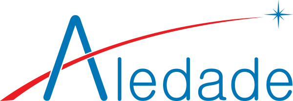
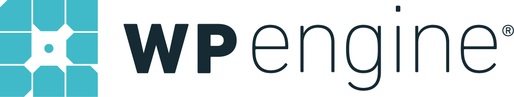

# SFTPGo

Full-featured and highly configurable event-driven file transfer solution.
Server protocols: SFTP, HTTP/S, FTP/S, WebDAV.
Storage backends: local filesystem, encrypted local filesystem, S3 (compatible) Object Storage, Google Cloud Storage, Azure Blob Storage, other SFTP servers.

With SFTPGo you can leverage local and cloud storage backends for exchanging and storing files internally or with business partners using the same tools and processes you are already familiar with.

The WebAdmin UI allows to easily create and manage your users, folders, groups and other resources.

The WebClient UI allows end users to change their credentials, browse and manage their files in the browser and setup two-factor authentication which works with Microsoft Authenticator, Google Authenticator, Authy and other compatible apps.

## Sponsors

We strongly believe in Open Source software model, so we decided to make SFTPGo available to everyone, but maintaining and evolving SFTPGo takes a lot of time and work. To make development and maintenance sustainable you should consider to support the project with a [sponsorship](https://github.com/sponsors/drakkan).

We love doing the work and we'd like to keep doing it - your support helps make SFTPGo possible.

It is important to understand that you should support SFTPGo and any other Open Source project you rely on for ongoing maintenance, even if you don't have any questions or need new features, to mitigate the business risk of a project you depend on going unmaintained, with its security and development velocity implications.

### Thank you to our sponsors

#### Platinum sponsors

  

  

#### Silver sponsors

#### Bronze sponsors

  

## Support

You can use SFTPGo for free, respecting the obligations of the Open Source [license](#license), but please do not ask or expect free support as well.

Use [discussions](https://github.com/drakkan/sftpgo/discussions) to ask questions and get support from the community.

We offer commercial support, guarantees, and advice for SFTPGo:

- With our [plans](https://sftpgo.com/plans) you can safely install and use SFTPGo on-premise in professional environments.
- With our [SaaS offerings](https://sftpgo.com/saas) you can use SFTPGo hosted in the cloud, fully managed and supported.

## Documentation

You can read more about supported features and documentation at [docs.sftpgo.com](https://docs.sftpgo.com/).

## Internationalization

The translations are available via [Crowdin](https://crowdin.com/project/sftpgo), who have granted us an open source license.

Before start translating please take a look at our contribution [guidelines](https://sftpgo.github.io/latest/web-interfaces/#internationalization).

## Release Cadence

SFTPGo releases are feature-driven, we don't have a fixed time based schedule. As a rough estimate, you can expect 1 or 2 new major releases per year and several bug fix releases.

## Acknowledgements

SFTPGo makes use of the third party libraries listed inside [go.mod](./go.mod).

We are very grateful to all the people who contributed with ideas and/or pull requests.

Thank you to [ysura](https://www.ysura.com/) for granting us stable access to a test AWS S3 account.

Thank you to [KeenThemes](https://keenthemes.com/) for granting us a custom license to use their amazing [Mega Bundle](https://keenthemes.com/products/templates-mega-bundle) for SFTPGo UI.

Thank you to [Crowdin](https://crowdin.com/) for granting us an Open Source License.

Thank you to [Incode](https://www.incode.it/) for helping us to improve the UI/UX.

## License

SFTPGo source code is licensed under the GNU AGPL-3.0-only with [additional terms](./NOTICE).

The [theme](https://keenthemes.com/products/templates-mega-bundle) used in WebAdmin and WebClient user interfaces is proprietary, this means:

- KeenThemes HTML/CSS/JS components are allowed for use only within the SFTPGo product and restricted to be used in a resealable HTML template that can compete with KeenThemes products anyhow.
- The SFTPGo WebAdmin and WebClient user interfaces (HTML, CSS and JS components) based on this theme are allowed for use only within the SFTPGo product and therefore cannot be used in derivative works/products without an explicit grant from the [SFTPGo Team](mailto:support@sftpgo.com).

More information about [compliance](https://sftpgo.com/compliance.html).

## Copyright

Copyright (C) 2019 Nicola Murino
