# Getting Started

SFTPGo allows to securely share your files over SFTP and optionally FTP/S and WebDAV too.
Several storage backends are supported and they are configurable per user, so you can serve a local directory for a user and an S3 bucket (or part of it) for another one.
SFTPGo also supports virtual folders, a virtual folder can use any of the supported storage backends. So you can have, for example, an S3 user that exposes a GCS bucket (or part of it) on a specified path and an encrypted local filesystem on another one.
Virtual folders can be private or shared among multiple users, for shared virtual folders you can define different quota limits for each user.

In this tutorial we explore the main features and concepts using the built-in web admin interface. Advanced users can also use the SFTPGo [REST API](https://sftpgo.stoplight.io/docs/sftpgo/openapi.yaml)

- [Installation](#Installation)
- [Initial configuration](#Initial-configuration)
- [Creating users](#Creating-users)
  - [Creating users with a Cloud Storage backend](#Creating-users-with-a-Cloud-Storage-backend)
  - [Creating users with a local encrypted backend (Data At Rest Encryption)](#Creating-users-with-a-local-encrypted-backend-Data-At-Rest-Encryption))
- [Virtual permissions](#Virtual-permissions)
- [Virtual folders](#Virtual-folders)
- [Configuration parameters](#Configuration-parameters)
  - [Use PostgreSQL data provider](#Use-PostgreSQL-data-provider)
  - [Use MySQL/MariaDB data provider](#Use-MySQLMariaDB-data-provider)
  - [Use CockroachDB data provider](#Use-CockroachDB-data-provider)
  - [Enable FTP service](#Enable-FTP-service)
  - [Enable WebDAV service](#Enable-WebDAV-service)

## Installation

You can easily install SFTPGo by downloading the appropriate package for your operating system and architecture. Please visit the [releases](https://github.com/drakkan/sftpgo/releases "releases") page.

An official Docker image is available. Documentation is [here](./../../docker/README.md).

In this guide, we assume that SFTPGo is already installed and running using the default configuration.

## Initial configuration

Before you can use SFTPGo you need to create an admin account, so open [http://127.0.0.1:8080/web/admin](http://127.0.0.1:8080/web) in your web browser, replacing `127.0.0.1` with the appropriate IP address if SFTPGo is not running on localhost.

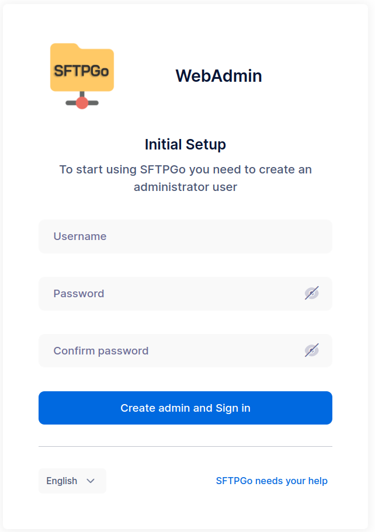

After creating the admin account you will be automatically logged in.

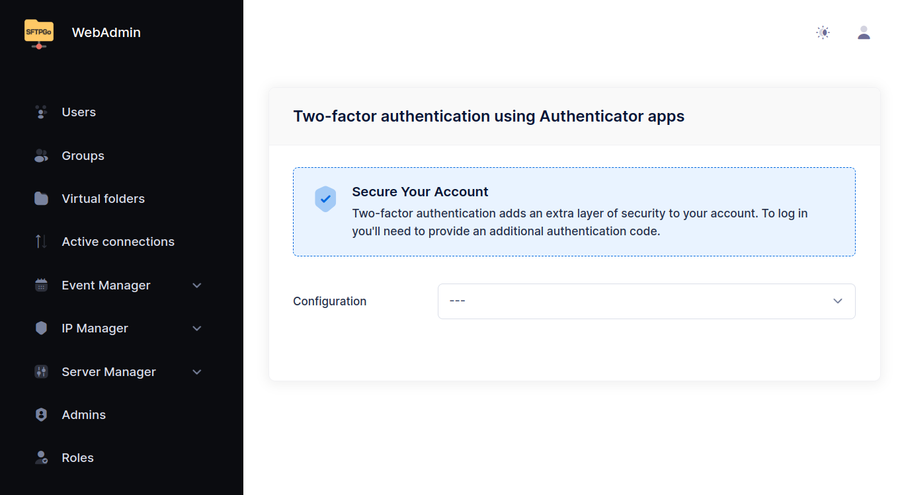

The web admin is now available at the following URL:

[http://127.0.0.1:8080/web/admin](http://127.0.0.1:8080/web/admin)

From the `Status` page you see the active services.

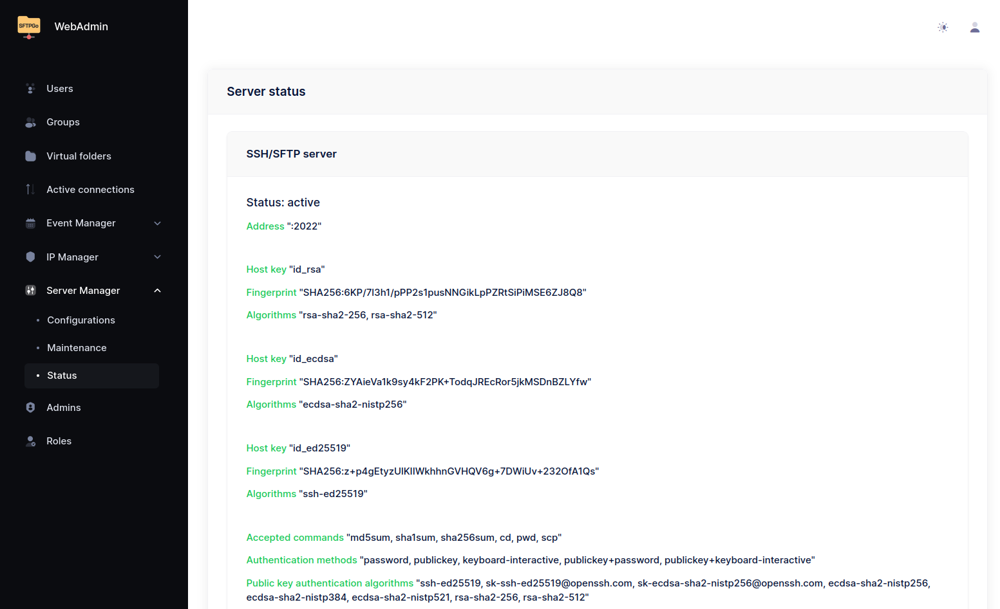

The default configuration enables the SFTP service on port `2022` and uses an embedded data provider (`SQLite` or `bolt` based on the target OS and architecture).

## Creating users

Let's create our first local user:

- from the users page click the `+` icon to open the Add user page
- the only required fields are the `Username`, a `Password` or a `Public key`, and the default `Permissions`
- if you are on Windows or you installed SFTPGo manually and no `users_base_dir` is defined in your configuration file you also have to set a `Home Dir`. It must be an absolute path, for example `/srv/sftpgo/data/username` on Linux or `C:\sftpgo\data\username` on Windows. SFTPGo will try to automatically create the home directory, if missing, when the user logs in. Each user can only access files and folders inside its home directory.
- click `Submit`

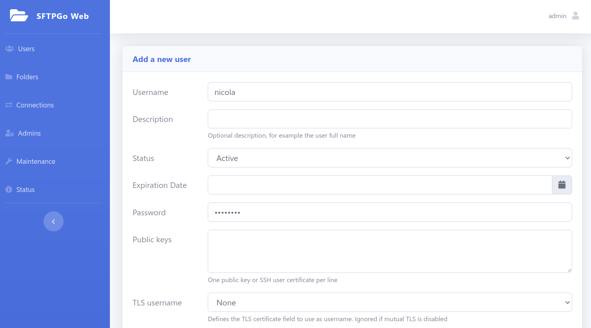

Now test the new user, we use the `sftp` CLI here, you can use any SFTP client.

```shell
$ sftp -P 2022 nicola@127.0.0.1
nicola@127.0.0.1's password:
Connected to 127.0.0.1.
sftp> ls
sftp> put file.txt
Uploading file.txt to /file.txt
file.txt                                      100% 4034     3.9MB/s   00:00
sftp> ls
file.txt
sftp> mkdir adir
sftp> cd adir/
sftp> put file.txt
Uploading file.txt to /adir/file.txt
file.txt                                      100% 4034     4.0MB/s   00:00
sftp> ls
file.txt
sftp> get file.txt
Fetching /adir/file.txt to file.txt
/adir/file.txt                                100% 4034     1.9MB/s   00:00
```

It worked! We can upload/download files and create directories.

Each user can browse and download their files and change their credentials using the web client interface available at the following URL:

[http://127.0.0.1:8080/web/client](http://127.0.0.1:8080/web/client)

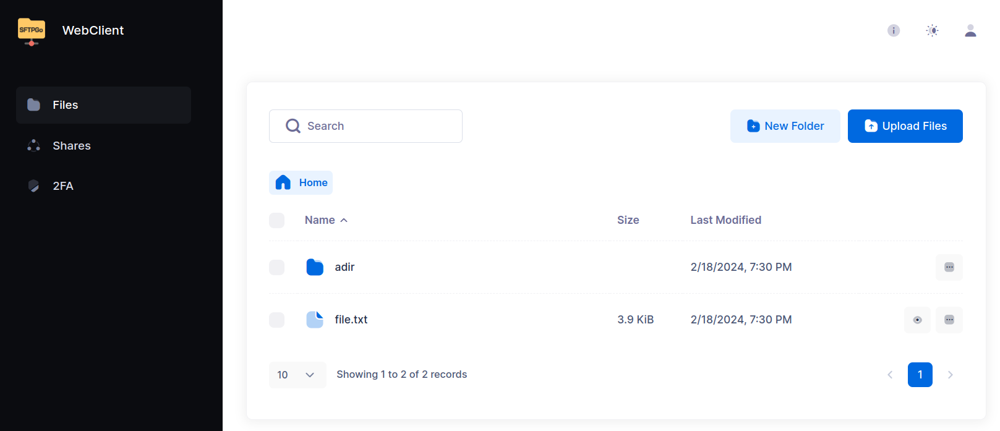

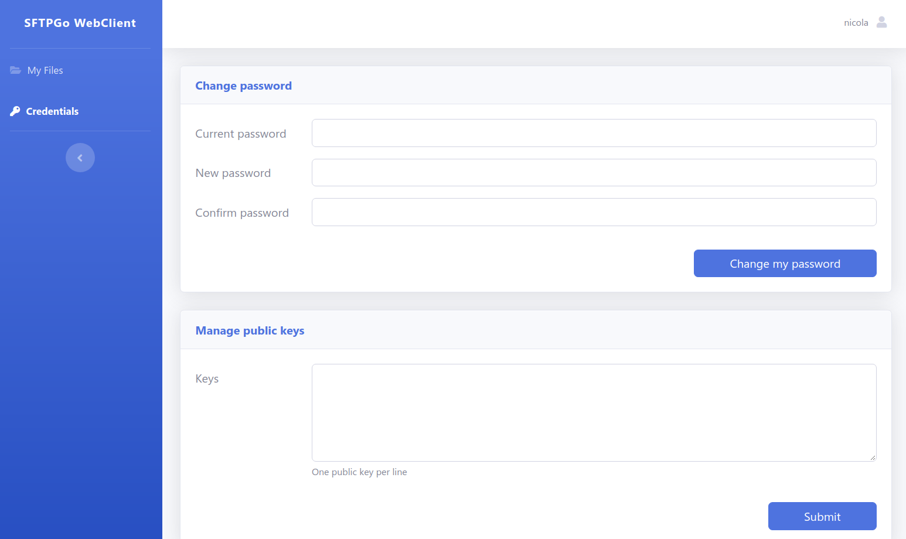

### Creating users with a Cloud Storage backend

The procedure is similar to the one described for local users, you have only specify the Cloud Storage backend and its credentials.

The screenshot below shows an example configuration for an S3 backend.

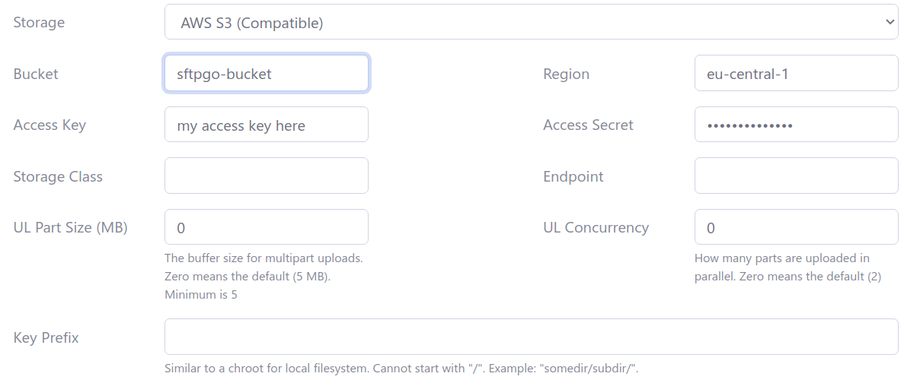

The screenshot below shows an example configuration for an Azure Blob Storage backend.

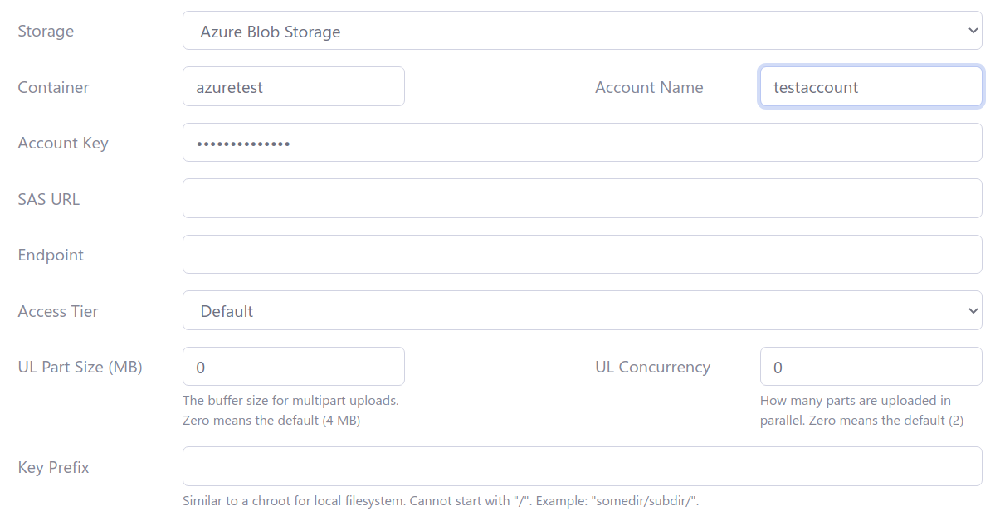

The screenshot below shows an example configuration for a Google Cloud Storage backend.

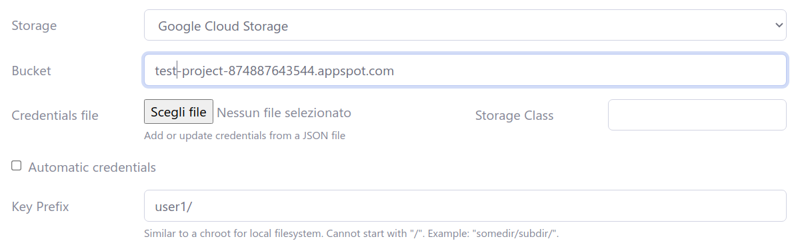

The screenshot below shows an example configuration for an SFTP server as storage backend.

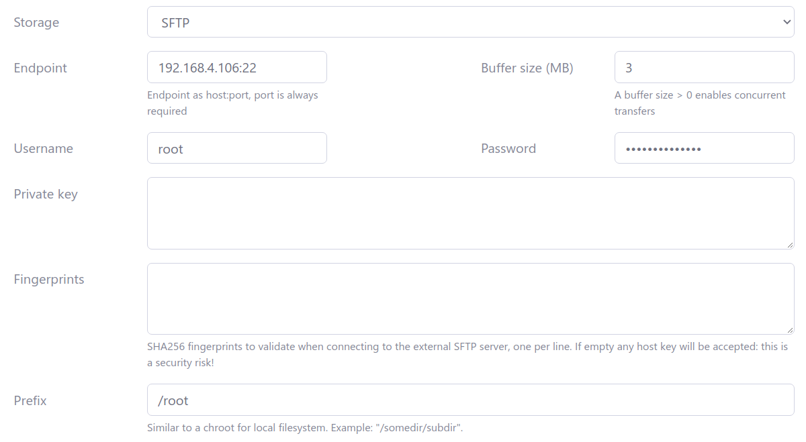

Setting a `Key Prefix` you restrict the user to a specific "folder" in the bucket, so that the same bucket can be shared among different users by assigning to each user a specific portion of the bucket.

### Creating users with a local encrypted backend (Data At Rest Encryption)

The procedure is similar to the one described for local users, you have only specify the encryption passphrase.
The screenshot below shows an example configuration.

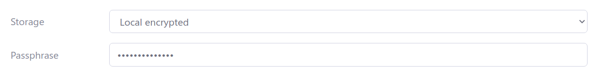

You can find more details about Data At Rest Encryption [here](../dare.md).

## Virtual permissions

SFTPGo supports per directory virtual permissions. For each user you have to specify global permissions and then override them on a per-directory basis.

Take a look at the following screens.

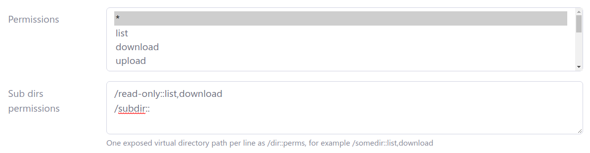
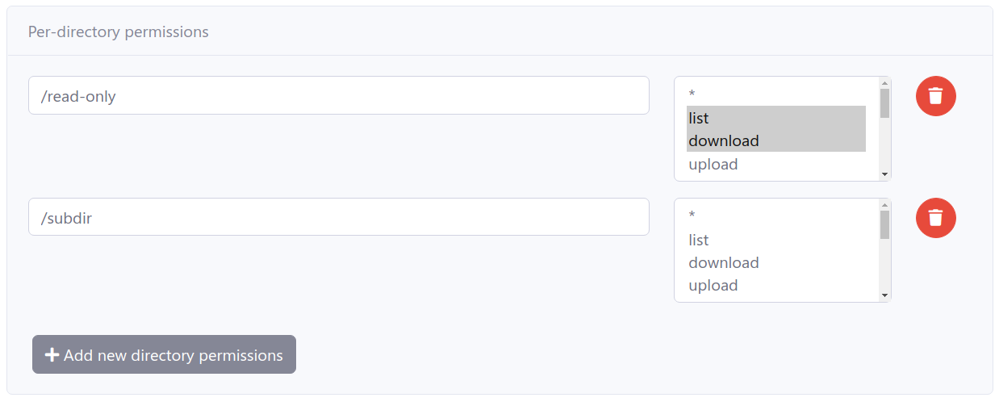

This user has full access as default (`*`), can only list and download from `/read-only` path and has no permissions at all for the `/subdir` path.

Let's test it. We use the `sftp` CLI here, you can use any SFTP client.

```shell
$ sftp -P 2022 nicola@127.0.0.1
Connected to 127.0.0.1.
sftp> ls
adir        file.txt    read-only   subdir
sftp> put file.txt
Uploading file.txt to /file.txt
file.txt                                                                  100% 4034    19.4MB/s   00:00
sftp> rm file.txt
Removing /file.txt
sftp> ls
adir        read-only   subdir
sftp> cd read-only/
sftp> ls
file.txt
sftp> put file1.txt
Uploading file1.txt to /read-only/file1.txt
remote open("/read-only/file1.txt"): Permission denied
sftp> get file.txt
Fetching /read-only/file.txt to file.txt
/read-only/file.txt                                                       100% 4034     2.2MB/s   00:00
sftp> cd ..
sftp> ls
adir        read-only   subdir
sftp> cd /subdir
sftp> ls
remote readdir("/subdir"): Permission denied
```

as you can see it worked as expected.

## Virtual folders

From the web admin interface click `Folders` and then the `+` icon.


To create a local folder you need to specify a `Name` and an `Absolute path`. For other backends you have to specify the backend type and its credentials, this is the same procedure already detailed for creating users with cloud backends.

Suppose we created two virtual folders name `localfolder` and `minio` as you can see in the following screen.

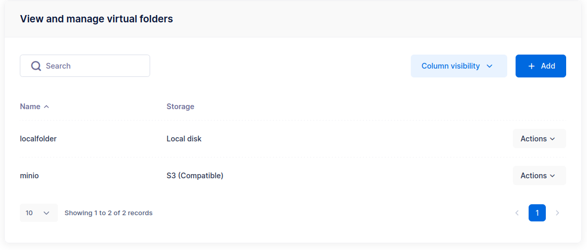

- `localfolder` uses the local filesystem as storage backend
- `minio` uses MinIO (S3 compatible) as storage backend

Now, click `Users`, on the left menu, select a user and click the `Edit` icon, to update the user and associate the virtual folders.

Virtual folders must be referenced using their unique name and you can expose them on a configurable virtual path. Take a look at the following screenshot.

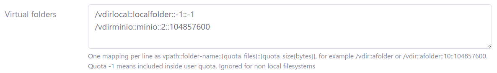

We exposed the folder named `localfolder` on the path `/vdirlocal` (this must be an absolute UNIX path on Windows too) and the folder named `minio` on the path `/vdirminio`. For `localfolder` the quota usage is included within the user quota, while for the `minio` folder we defined separate quota limits: at most 2 files and at most 100MB, whichever is reached first.

The folder `minio` can be shared with other users and we can define different quota limits on a per-user basis. The folder `localfolder` is considered private since we have included its quota limits within those of the user, if we share them with other users we will break quota calculation.

Let's test these virtual folders. We use the `sftp` CLI here, you can use any SFTP client.

```shell
$ sftp -P 2022 nicola@127.0.0.1
nicola@127.0.0.1's password:
Connected to 127.0.0.1.
sftp> ls
adir        read-only   subdir      vdirlocal   vdirminio
sftp> cd vdirlocal
sftp> put file.txt
Uploading file.txt to /vdirlocal/file.txt
file.txt                                                                  100% 4034    17.3MB/s   00:00
sftp> ls
file.txt
sftp> cd ..
sftp> cd vdirminio/
sftp> put file.txt
Uploading file.txt to /vdirminio/file.txt
file.txt                                                                  100% 4034     4.8MB/s   00:00
sftp> ls
file.txt
sftp> put file.txt file1.txt
Uploading file.txt to /vdirminio/file1.txt
file.txt                                                                  100% 4034     2.8MB/s   00:00
sftp> put file.txt file2.txt
Uploading file.txt to /vdirminio/file2.txt
remote open("/vdirminio/file2.txt"): Failure
sftp> quit
```

The last upload failed since we exceeded the number of files quota limit.

## Configuration parameters

Until now we used the default configuration, to change the global service parameters you have to edit the configuration file, or set appropriate environment variables, and restart SFTPGo to apply the changes.

A full explanation of all configuration methods can be found [here](./../full-configuration.md), we explore some common use cases. Please keep in mind that SFTPGo can also be configured via [environment variables](../full-configuration.md#environment-variables), this is very convenient if you are using Docker.

The default configuration file is `sftpgo.json` and it can be found within the `/etc/sftpgo` directory if you installed from Linux distro packages. On Windows the configuration file can be found within the `{commonappdata}\SFTPGo` directory where `{commonappdata}` is typically `C:\ProgramData`. SFTPGo also supports reading from TOML and YAML configuration files.

The following snippets assume your are running SFTPGo on Linux but they can be easily adapted for other operating systems.

### Use PostgreSQL data provider

Create a PostgreSQL database named `sftpgo` and a PostgreSQL user with the correct permissions, for example using the `psql` CLI.

```shell
sudo -i -u postgres psql
CREATE DATABASE "sftpgo" WITH ENCODING='UTF8' CONNECTION LIMIT=-1;
create user "sftpgo" with encrypted password 'your password here';
grant all privileges on database "sftpgo" to "sftpgo";
\q
```

Open the SFTPGo configuration file, search for the `data_provider` section and change it as follow.

```json
  "data_provider": {
    "driver": "postgresql",
    "name": "sftpgo",
    "host": "127.0.0.1",
    "port": 5432,
    "username": "sftpgo",
    "password": "your password here",
    ...
}
```

Confirm that the database connection works by initializing the data provider.

```shell
$ sudo su - sftpgo -s /bin/bash -c 'sftpgo initprovider -c /etc/sftpgo'
2021-05-19T22:21:54.000 INF Initializing provider: "postgresql" config file: "/etc/sftpgo/sftpgo.json"
2021-05-19T22:21:54.000 INF updating database version: 8 -> 9
2021-05-19T22:21:54.000 INF Data provider successfully initialized/updated
```

Ensure that SFTPGo starts after the database service.

```shell
sudo systemctl edit sftpgo.service
```

And override the unit definition with the following snippet.

```shell
[Unit]
After=postgresql.service
```

Restart SFTPGo to apply the changes.

### Use MySQL/MariaDB data provider

Create a MySQL database named `sftpgo` and a MySQL user with the correct permissions, for example using the `mysql` CLI.

```shell
$ mysql -u root
MariaDB [(none)]> CREATE DATABASE sftpgo CHARACTER SET utf8mb4 COLLATE utf8mb4_unicode_ci;
Query OK, 1 row affected (0.000 sec)

MariaDB [(none)]> grant all privileges on sftpgo.* to sftpgo@localhost identified by 'your password here';
Query OK, 0 rows affected (0.027 sec)

MariaDB [(none)]> quit
Bye
```

Open the SFTPGo configuration file, search for the `data_provider` section and change it as follow.

```json
  "data_provider": {
    "driver": "mysql",
    "name": "sftpgo",
    "host": "127.0.0.1",
    "port": 3306,
    "username": "sftpgo",
    "password": "your password here",
    ...
}
```

Confirm that the database connection works by initializing the data provider.

```shell
$ sudo su - sftpgo -s /bin/bash -c 'sftpgo initprovider -c /etc/sftpgo'
2021-05-19T22:29:30.000 INF Initializing provider: "mysql" config file: "/etc/sftpgo/sftpgo.json"
2021-05-19T22:29:30.000 INF updating database version: 8 -> 9
2021-05-19T22:29:30.000 INF Data provider successfully initialized/updated
```

Ensure that SFTPGo starts after the database service.

```shell
sudo systemctl edit sftpgo.service
```

And override the unit definition with the following snippet.

```shell
[Unit]
After=mariadb.service
```

Restart SFTPGo to apply the changes.

### Use CockroachDB data provider

We suppose you have installed CockroachDB this way:

```shell
sudo su
export CRDB_VERSION=21.1.2 # set the latest available version here
wget -qO- https://binaries.cockroachdb.com/cockroach-v${CRDB_VERSION}.linux-amd64.tgz | tar xvz
cp -i cockroach-v${CRDB_VERSION}.linux-amd64/cockroach /usr/local/bin/
mkdir -p /usr/local/lib/cockroach
cp -i cockroach-v${CRDB_VERSION}.linux-amd64/lib/libgeos.so /usr/local/lib/cockroach/
cp -i cockroach-v${CRDB_VERSION}.linux-amd64/lib/libgeos_c.so /usr/local/lib/cockroach/
mkdir /var/lib/cockroach
chown sftpgo:sftpgo /var/lib/cockroach
mkdir -p /etc/cockroach/{certs,ca}
chmod 700 /etc/cockroach/ca
/usr/local/bin/cockroach cert create-ca --certs-dir=/etc/cockroach/certs --ca-key=/etc/cockroach/ca/ca.key
/usr/local/bin/cockroach cert create-node localhost $(hostname) --certs-dir=/etc/cockroach/certs --ca-key=/etc/cockroach/ca/ca.key
/usr/local/bin/cockroach cert create-client root --certs-dir=/etc/cockroach/certs --ca-key=/etc/cockroach/ca/ca.key
chown -R sftpgo:sftpgo /etc/cockroach/certs
exit
```

and you are running it using a systemd unit like this one:

```shell
[Unit]
Description=Cockroach Database single node
Requires=network.target
[Service]
Type=notify
WorkingDirectory=/var/lib/cockroach
ExecStart=/usr/local/bin/cockroach start-single-node --certs-dir=/etc/cockroach/certs --http-addr 127.0.0.1:8888 --listen-addr 127.0.0.1:26257 --cache=.25 --max-sql-memory=.25 --store=path=/var/lib/cockroach
TimeoutStopSec=60
Restart=always
RestartSec=10
StandardOutput=syslog
StandardError=syslog
SyslogIdentifier=cockroach
User=sftpgo
[Install]
WantedBy=default.target
```

Create a CockroachDB database named `sftpgo`.

```shell
$ sudo /usr/local/bin/cockroach sql --certs-dir=/etc/cockroach/certs -e 'create database "sftpgo"'
CREATE DATABASE

Time: 13ms
```

Open the SFTPGo configuration file, search for the `data_provider` section and change it as follow.

```json
  "data_provider": {
    "driver": "cockroachdb",
    "name": "",
    "host": "",
    "port": 0,
    "username": "",
    "password": "",
    "sslmode": 0,
    "connection_string": "postgresql://root@localhost:26257/sftpgo?sslcert=%2Fetc%2Fcockroach%2Fcerts%2Fclient.root.crt&sslkey=%2Fetc%2Fcockroach%2Fcerts%2Fclient.root.key&sslmode=verify-full&sslrootcert=%2Fetc%2Fcockroach%2Fcerts%2Fca.crt&connect_timeout=10"
    ...
}
```

Confirm that the database connection works by initializing the data provider.

```shell
$ sudo su - sftpgo -s /bin/bash -c 'sftpgo initprovider -c /etc/sftpgo'
2021-05-19T22:41:53.000 INF Initializing provider: "cockroachdb" config file: "/etc/sftpgo/sftpgo.json"
2021-05-19T22:41:53.000 INF updating database version: 8 -> 9
2021-05-19T22:41:53.000 INF Data provider successfully initialized/updated
```

Ensure that SFTPGo starts after the database service.

```shell
sudo systemctl edit sftpgo.service
```

And override the unit definition with the following snippet.

```shell
[Unit]
After=cockroachdb.service
```

Restart SFTPGo to apply the changes.

### Enable FTP service

Open the SFTPGo configuration file, search for the `ftpd` section and change it as follow.

```json
  "ftpd": {
    "bindings": [
      {
        "port": 2121,
        "address": "",
        "apply_proxy_config": true,
        "tls_mode": 0,
        "force_passive_ip": "",
        "client_auth_type": 0,
        "tls_cipher_suites": []
      }
    ],
    "banner": "",
    "banner_file": "",
    "active_transfers_port_non_20": true,
    "passive_port_range": {
      "start": 50000,
      "end": 50100
    },
    ...
  }
```

Restart SFTPGo to apply the changes. The FTP service is now available on port `2121`.

You can also configure the passive ports range (`50000-50100` by default), these ports must be reachable for passive FTP to work. If your FTP server is on the private network side of a NAT configuration you have to set `force_passive_ip` to your external IP address. You may also need to open the passive port range on your firewall.

It is recommended that you provide a certificate and key file to expose FTP over TLS. You should prefer SFTP to FTP even if you configure TLS, please don't blindly enable the old FTP protocol.

### Enable WebDAV service

Open the SFTPGo configuration file, search for the `webdavd` section and change it as follow.

```json
  "webdavd": {
    "bindings": [
      {
        "port": 10080,
        "address": "",
        "enable_https": false,
        "client_auth_type": 0,
        "tls_cipher_suites": [],
        "prefix": "",
        "proxy_allowed": []
      }
    ],
    ...
  }
```

Restart SFTPGo to apply the changes. The WebDAV service is now available on port `10080`. It is recommended that you provide a certificate and key file to expose WebDAV over https.
